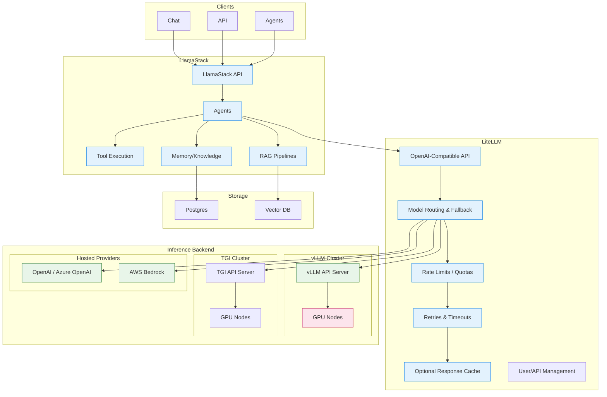

# LiteLLM and LlamaStack Integration

> Unified LLM Gateway and AI Application Framework for Red Hat OpenShift AI

---

## Table of Contents

- [Detailed Description](#detailed-description)
- [See it in Action](#see-it-in-action)
- [Architecture Diagrams](#architecture-diagrams)
- [Requirements](#requirements)
  - [Minimum Hardware Requirements](#minimum-hardware-requirements)
  - [Minimum Software Requirements](#minimum-software-requirements)
  - [Required User Permissions](#required-user-permissions)
- [Deploy](#deploy)
- [Delete](#delete)
- [References](#references)
- [Technical Details](#technical-details)
- [Tags](#tags)

---

## Detailed Description

This repository explores integrating LiteLLM with LlamaStack in the context of Red Hat OpenShift AI (RHOAI). Given LlamaStack's widespread adoption across RHOAI repositories, our goal is to evaluate LiteLLM's features and assess how it can be utilized within Red Hat's infrastructure, including Red Hat AI.

### What is LiteLLM?

[LiteLLM Official Documentation](https://docs.litellm.ai/docs/)

> [!NOTE]
> LiteLLM is an open-source library and gateway that provides a unified interface for over 100 Large Language Model (LLM) APIs. It allows developers to call models from providers like OpenAI, Anthropic, Azure, and Google using a single, consistent OpenAI-like format. Acting as a universal adapter, it simplifies integration, enables model swapping, and offers features like cost tracking, load balancing, and rate limiting for production applications.

**LiteLLM** is an open-source platform that provides a unified interface to manage and access over 100 LLMs from various providers ([Arize](https://arize.com/docs/phoenix/integrations/llm-providers/litellm)). It focuses primarily on model access and API translation.

### What is LlamaStack?

[LlamaStack Official Documentation](https://llamastack.github.io/docs)

> [!NOTE]
> Llama Stack defines and standardizes the core building blocks needed to bring generative AI applications to market. It provides a unified set of APIs with implementations from leading service providers, enabling seamless transitions between development and production environments.
>
> Key features include:
> - **Unified API layer** for Inference, RAG, Agents, Tools, Safety, Evals, and Telemetry
> - **Plugin architecture** supporting implementations across local development, on-premises, cloud, and mobile environments
> - **Prepackaged verified distributions** for quick and reliable setup in any environment
> - **Multiple developer interfaces** including CLI and SDKs for Python, Node, iOS, and Android
> - **Standalone applications** as examples for building production-grade AI applications

**LlamaStack** is an open-source framework for building generative AI applications with unified APIs for Inference, RAG, Agents, Tools, Safety, and Telemetry ([LlamaStack](https://llamastack.github.io)). It serves as a comprehensive application framework.

### Why Use Them Together?

Both tools aim to simplify working with large language models by providing abstraction layers, though they approach this goal differently:

| Aspect | Description |
|--------|-------------|
| **Unified Interfaces** | Both provide standardized APIs to work with multiple LLM providers, reducing the need to learn provider-specific APIs |
| **Multi-Provider Support** | Both support numerous LLM providers including OpenAI, Anthropic, Azure, and others |
| **Developer-Friendly** | Both are open-source projects designed to streamline LLM application development |
| **Python Ecosystem** | Both offer Python SDKs as a core part of their offerings |

By integrating LiteLLM with LlamaStack, you get the best of both worlds:

- **LlamaStack** excels as a comprehensive framework for building advanced generative AI applications, offering RAG, safety guardrails, memory management, and agentic systems.
- **LiteLLM** excels as a lightweight gateway for accessing and managing LLM APIs, with strong features for cost tracking, rate limiting, key management, and operational controls.

### Feature Comparison

| Feature | LiteLLM | LlamaStack |
|---------|:-------:|:----------:|
| API Key Management | ✓ | ✗ |
| Rate Limiting | ✓ | ✗ |
| Load Balancing | ✓ | ✗ |
| Caching | ✓ | ✗ |
| Fallback/Retry Logic | ✓ | ✗ |
| Cost Tracking | ✓ | ✗ |
| Telemetry/Monitoring | ✓ | ✓ |
| Multi-Provider Gateway | ✓ | ✓ |
| Agent/Agentic System | ✗ | ✓ |
| RAG (Built-in) | ✗ | ✓ |
| Memory Management | ✗ | ✓ |
| Safety Guardrails | ✗ | ✓ |
| Tool/Function Calling | ✗ | ✓ |
| Prompt Guard | ✗ | ✓ |
| Evaluation Framework | ✗ | ✓ |
| Vector Store Integration | ✗ | ✓ |
| Multi-turn Conversations | ✗ | ✓ |
| Mobile SDK Support | ✗ | ✓ |

---

## See it in Action

Navigate to the `/demos` folder to see the integration in action. All demos are deployable to Red Hat's OpenShift environment.

| Demo | Description |
|------|-------------|
| [Budgeting Demo](demos/budget_demo.md) | Demonstrates budget management and cost tracking |
| [LLM Failover Demo](demos/failover_demo.md) | Shows automatic failover between LLM providers |
| [LlamaStack vs LiteLLM Client](demos/llamastack_client_vs_llm_client.md) | **Proves client interchangeability** - Shows that LlamaStack and LiteLLM clients can be swapped with minimal code changes because both use OpenAI-compatible APIs |
| [LlamaStack Integration](demos/llamastack_test.py) | Demonstrates LlamaStack and LiteLLM working together |

### Chat Interface

We provide a Streamlit-based chat interface for interacting with the LiteLLM gateway. This application allows users to configure LiteLLM settings via the Admin UI and observe the effects in real-time through the chat interface.

See the [UI application documentation](apps/ui/README.md) for more details.

### Client Interchangeability Demo

The [LlamaStack vs LiteLLM Client Demo](demos/llamastack_client_vs_llm_client.md) is particularly important as it proves a key architectural benefit: **both clients use OpenAI-compatible interfaces**, allowing you to swap between providers with minimal code changes.

After deploying with Helm, you can run this demo by pointing it at your deployed services:

```bash
# Set environment variables to your deployed routes
export LITELLM_URL="https://litellm-litellm.apps.your-cluster.example.com"
export LLAMASTACK_URL="https://llamastack-litellm.apps.your-cluster.example.com"
export LITELLM_MASTER_API_KEY="master-key"
export LITELLM_API_KEY="sk-eng-user-key"
export LLAMA_STACK_API_KEY="sk-eng-user-key"

# Run with LiteLLM
python demos/llamastack_client_vs_llm_client.py

# Run with LlamaStack
DEMO_PROVIDER=llamastack python demos/llamastack_client_vs_llm_client.py
```

---

## Architecture Diagrams

The following diagram illustrates the recommended configuration when using LlamaStack and LiteLLM together:



### What Gets Deployed

| Component | Purpose |
|-----------|---------|
| **LiteLLM API** | Powers the chat applications (inference, budgeting, rate limiting) |
| **LiteLLM Admin UI** | Configuration and management interface for LiteLLM |
| **Postgres** | Database storage for LiteLLM |
| **LlamaStack** | Unified AI API (Agents, RAG, Knowledge) |

---

## Requirements

### Minimum Hardware Requirements

| Resource | Requirement |
|----------|-------------|
| CPU | 4 vCPUs |
| Memory | 8 GB RAM |
| Storage | 20 GB available disk space |
| GPU | Required for self-hosted LLM inference (NVIDIA recommended) |

> [!NOTE]
> Hardware requirements vary based on the LLM serving solution. When using hosted providers (OpenAI, Anthropic, etc.), GPU is not required for the gateway components.

### Minimum Software Requirements

| Software | Version |
|----------|---------|
| Red Hat OpenShift | 4.14+ |
| Helm | 3.x |
| Python | 3.12+ |
| Podman/Docker | Latest |

**LLM Serving Options (choose one):**

- **Self-hosted**: vLLM, TGI, or Ollama
- **Hosted providers**: OpenAI, Anthropic, Google, AWS Bedrock, Azure OpenAI

### Required User Permissions

| Permission | Purpose |
|------------|---------|
| `cluster-admin` or namespace admin | Required for deploying Helm charts |
| Create/manage `Deployments`, `Services`, `Routes` | Core application deployment |
| Create/manage `ConfigMaps`, `Secrets` | Configuration and credentials |
| Create/manage `Jobs` | Seed data loading |
| Access to model serving endpoints | LLM inference connectivity |

---

## Deploy

### Prerequisites

To run LiteLLM with LlamaStack, you must have an LLM serving solution or hosted provider available for inference. Options include:

- **Self-hosted**: Follow the [RHOAI Model Serving Tutorial](docs/RHOAI_model_serving.md) to serve an LLM using Red Hat OpenShift AI
- **Hosted providers**: Use services like Anthropic, OpenAI, Google, or AWS Bedrock
- **Local development**: Run Ollama for local testing

### Installation Steps

1. Clone the repository:

   ```bash
   git clone <repository-url>
   cd rhoai-litellm-poc
   ```

2. Navigate to the deploy directory:

   ```bash
   cd deploy
   ```

3. Run the installation:

   ```bash
   make install NAMESPACE=<your_namespace>
   ```

4. Wait for the deployment to complete.

5. Access the deployed services:
   - Navigate to the LiteLLM UI route in OpenShift
   - Follow the demo documentation to run specific demos

### Seed Data

The Helm deployment includes a job that loads sample data into LiteLLM. The `deploy/helm/templates/seed-job.yaml` file defines the job that creates users and teams for the demo.

Configuration values are defined in `values.yaml`:

```yaml
seed:
  enabled: true
  teams:
    - team_alias: engineering
      max_budget: 100.0
    - team_alias: marketing
      max_budget: 50.0
  users:
    - user_email: eng-user@example.com
      team_alias: engineering
    - user_email: mkt-user@example.com
      team_alias: marketing
```

> [!NOTE]
> See the [LiteLLM Overview](litellm_overview.md) for detailed information on running and configuring the demo application.

---

## Delete

To remove the deployment from your OpenShift cluster:

1. Navigate to the deploy directory:

   ```bash
   cd deploy
   ```

2. Run the uninstall command:

   ```bash
   make uninstall NAMESPACE=<your_namespace>
   ```

3. (Optional) Clean up any persistent volumes or secrets that were created:

   ```bash
   oc delete pvc --all -n <your_namespace>
   oc delete secret litellm-secrets -n <your_namespace>
   ```

---

## References

- [LiteLLM Official Documentation](https://docs.litellm.ai/docs/)
- [LlamaStack Official Documentation](https://llamastack.github.io/docs)
- [Red Hat OpenShift AI Documentation](https://docs.redhat.com/en/documentation/red_hat_openshift_ai/)
- [Arize LiteLLM Integration](https://arize.com/docs/phoenix/integrations/llm-providers/litellm)
- [vLLM Documentation](https://docs.vllm.ai/)
- [Helm Documentation](https://helm.sh/docs/)

---

## Technical Details

### Project Structure

```
rhoai-litellm-poc/
├── apps/
│   └── ui/                    # Streamlit chat interface
├── demos/                     # Demo scripts and documentation
│   ├── budget_demo.md
│   ├── failover_demo.md
│   ├── guardrails_demo.md
│   └── llamastack_client_vs_llm_client.md
├── deploy/
│   ├── helm/                  # Helm chart for deployment
│   │   ├── templates/         # Kubernetes manifests
│   │   └── values.yaml        # Configuration values
│   └── Makefile               # Deployment automation
├── docs/                      # Additional documentation and images
├── litellm_overview.md        # Detailed LiteLLM configuration guide
└── README.md
```

### API Compatibility

Both LlamaStack and LiteLLM expose OpenAI-compatible APIs, enabling:

- **Client Interchangeability**: Switch between providers with minimal code changes
- **Tool Compatibility**: Use existing OpenAI SDK tooling
- **Ecosystem Integration**: Leverage the broader OpenAI ecosystem

### Configuration

Key configuration files:

| File | Purpose |
|------|---------|
| `deploy/helm/values.yaml` | Helm chart configuration |
| `apps/ui/config.toml` | Streamlit UI configuration |
| `deploy/helm/templates/configmap.yaml` | LiteLLM configuration |

---

## Tags

`litellm` `llamastack` `openshift` `rhoai` `red-hat` `llm` `ai` `machine-learning` `mlops` `kubernetes` `helm` `python` `rag` `agents` `openai-compatible` `vllm` `tgi`

---

## Conclusion

LiteLLM and LlamaStack are complementary technologies that, when combined, provide a robust foundation for building enterprise-grade AI applications:

- **LlamaStack** delivers application-building capabilities: RAG, agents, safety guardrails, and tool execution
- **LiteLLM** adds operational controls: rate limiting, cost tracking, load balancing, and API key management

For organizations using Red Hat OpenShift AI, this integration offers a path to deploy scalable, secure, and manageable AI solutions. The demos in this repository demonstrate how these tools work together in practice, providing a starting point for teams looking to leverage both technologies within Red Hat's infrastructure.
