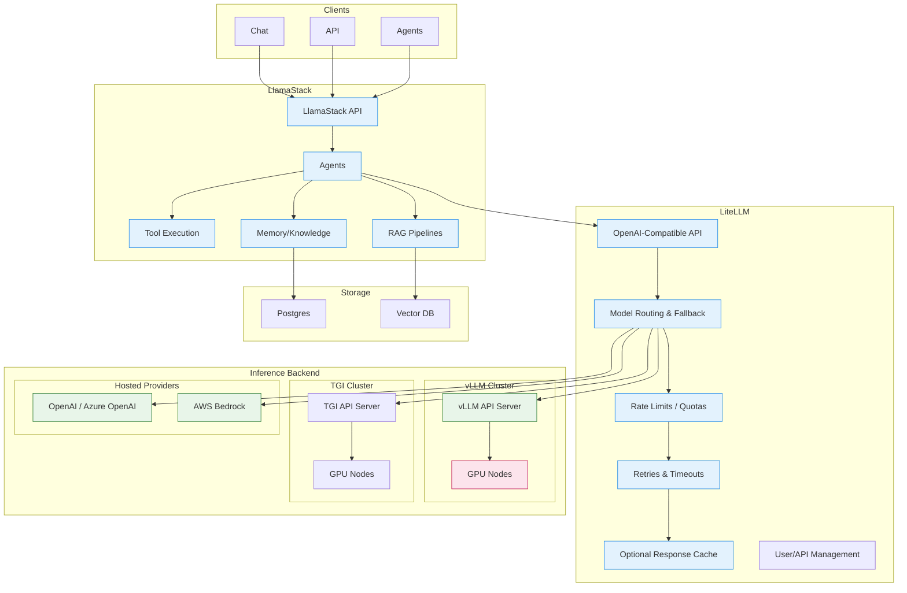

# LiteLLM and LlamaStack Integration

## Overview

This repository explores how LiteLLM integrates with LlamaStack in the context of Red Hat OpenShift AI (RHOAI). As LlamaStack is already widely adopted across RHOAI repositories, our goal is to evaluate LiteLLM's features and assess how it can be utilized within Red Hat's infrastructure, including Red Hat AI.

## Definitions

### LiteLLM
[LiteLLM Official Documentation](https://docs.litellm.ai/docs/)

> [!NOTE]
> LiteLLM is an open-source library and gateway that provides a unified interface for over 100 Large Language Model (LLM) APIs, allowing developers to call models from providers like OpenAI, Anthropic, Azure, and Google using a single, consistent OpenAI-like format. It acts as a universal adapter, simplifying integration, enabling model swapping, and offering features like cost tracking, load balancing, and rate limiting for production applications.

**LiteLLM** is an open-source platform that provides a unified interface to manage and access over 100 LLMs from various providers ([Arize](https://arize.com/docs/phoenix/integrations/llm-providers/litellm)). It focuses primarily on model access and API translation.

### LlamaStack
[LlamaStack Official Documentation](https://llamastack.github.io/docs)

> [!NOTE]
> Llama Stack defines and standardizes the core building blocks needed to bring generative AI applications to market. It provides a unified set of APIs with implementations from leading service providers, enabling seamless transitions between development and production environments. More specifically, it provides:
> - Unified API layer for Inference, RAG, Agents, Tools, Safety, Evals, and Telemetry.
> - Plugin architecture to support the rich ecosystem of implementations of the different APIs in different environments like local development, on-premises, cloud, and mobile.
> - Prepackaged verified distributions which offer a one-stop solution for developers to get started quickly and reliably in any environment.
> - Multiple developer interfaces like CLI and SDKs for Python, Node, iOS, and Android.
> - Standalone applications as examples for how to build production-grade AI applications with Llama Stack.

**LlamaStack** is an open-source framework for building generative AI applications with unified APIs for Inference, RAG, Agents, Tools, Safety, and Telemetry ([LlamaStack](https://llamastack.github.io)). It's a comprehensive application framework.

### Similarities

Both tools aim to simplify working with large language models by providing abstraction layers, though they approach this goal differently:
- **Unified interfaces**: Both provide standardized APIs to work with multiple LLM providers, reducing the need to learn different provider-specific APIs
- **Multi-provider support**: Both support numerous LLM providers including OpenAI, Anthropic, Azure, and others
- **Developer-friendly**: Both are open-source projects designed to streamline LLM application development
- **Python ecosystem**: Both offer Python SDKs as a core part of their offerings

## LiteLLM with LlamaStack

Based on our analysis of both LlamaStack and LiteLLM, it's clear that there are areas where these two technologies overlap—especially in providing a unified interface to various large language model (LLM) providers. However, each solution brings a unique set of features and strengths to the table. LlamaStack shines as a comprehensive framework for building advanced generative AI applications, offering capabilities like RAG, safety guardrails, memory management, and agentic systems. LiteLLM, on the other hand, excels as a lightweight gateway for accessing and managing a wide variety of LLM APIs, with strong features around cost tracking, rate limiting, key management, and operational controls.

By integrating LiteLLM with LlamaStack, you get the best of both worlds: the advanced application-building tools and unified APIs of LlamaStack, combined with LiteLLM's operational advantages such as easy model swapping, API translation, and enterprise-grade management features. Rather than competing, these tools complement each other—helping you build, deploy, and manage AI-powered applications more efficiently and securely. This integration can be especially valuable in enterprise and production environments where flexibility, scalability, and control are critical.

### LiteLLM's Value Add

What does LiteLLM provide that LlamaStack cannot? When configured correctly, LiteLLM can provide many features required for enterprise and robust applications:

| Feature | LiteLLM | LlamaStack |
|---|---|---|
| API Key Management | ✓ | ✗ |
| Rate Limiting | ✓ | ✗ |
| Load Balancing | ✓ | ✗ |
| Caching | ✓ | ✗ |
| Fallback/Retry Logic | ✓ | ✗ |
| Cost Tracking | ✓ | ✗ |
| Telemetry/Monitoring | ✓ | ✓ |
| Multi-Provider Gateway | ✓ | ✓ |
| Agent/Agentic System | ✗ | ✓ |
| RAG (Built-in) | ✗ | ✓ |
| Memory Management | ✗ | ✓ |
| Safety Guardrails | ✗ | ✓ |
| Tool/Function Calling | ✗ | ✓ |
| Prompt Guard | ✗ | ✓ |
| Evaluation Framework | ✗ | ✓ |
| Vector Store Integration | ✗ | ✓ |
| Multi-turn Conversations | ✗ | ✓ |
| Mobile SDK Support | ✗ | ✓ |

### Architecture

This lays out the possible configuration when using LlamaStack and LiteLLM together. 

## Demos

By using the configuration above, you can leverage the tools of both technologies to get an enterprise-level experience. We have proven this works using a few demos—please navigate to the `/demos` folder and see them in action. All demos are deployable to Red Hat's OpenShift environment.

### Serving Models

To run LiteLLM with LlamaStack in this configuration, you must have some type of LLM serving or hosted provider available in order to run inference. To serve an LLM using Red Hat OpenShift AI, follow the tutorial [here](docs/RHOAI_model_serving.md). If you are not serving your own model, you can use one of many providers like Anthropic, OpenAI, and Google, or run Ollama.

## Deploying The Demo Infrastructure

Before running the demos, you must deploy the infrastructure as follows:

1. Navigate to the `deploy` directory: `cd deploy`
2. Run `make install NAMESPACE=<your_namespace>`
3. Wait for it to finish.
4. Run demos by following documentation in the corresponding README.

You can use the [UI app](apps/ui/README.md) to interface with he liteLLM directly by navigating to the UI in Openshift or you can use the demos directly.

### Budgeting
[Budgeting Demo](demos/budget_demo.md)

### LLM Failover
[LLM Failover Demo](demos/failover_demo.md)

### LlamaStack Integration
[LlamaStack Integration Demo](demos/llamastack_test.py)

## Conclusion

LiteLLM and LlamaStack are complementary technologies that, when combined, provide a robust foundation for building enterprise-grade AI applications. LlamaStack delivers the application-building capabilities—RAG, agents, safety guardrails, and tool execution—while LiteLLM adds the operational controls necessary for production environments, including rate limiting, cost tracking, load balancing, and API key management.

For organizations using Red Hat OpenShift AI, this integration offers a path to deploy scalable, secure, and manageable AI solutions. The demos in this repository demonstrate how these tools work together in practice, providing a starting point for teams looking to leverage both technologies within Red Hat's infrastructure.
