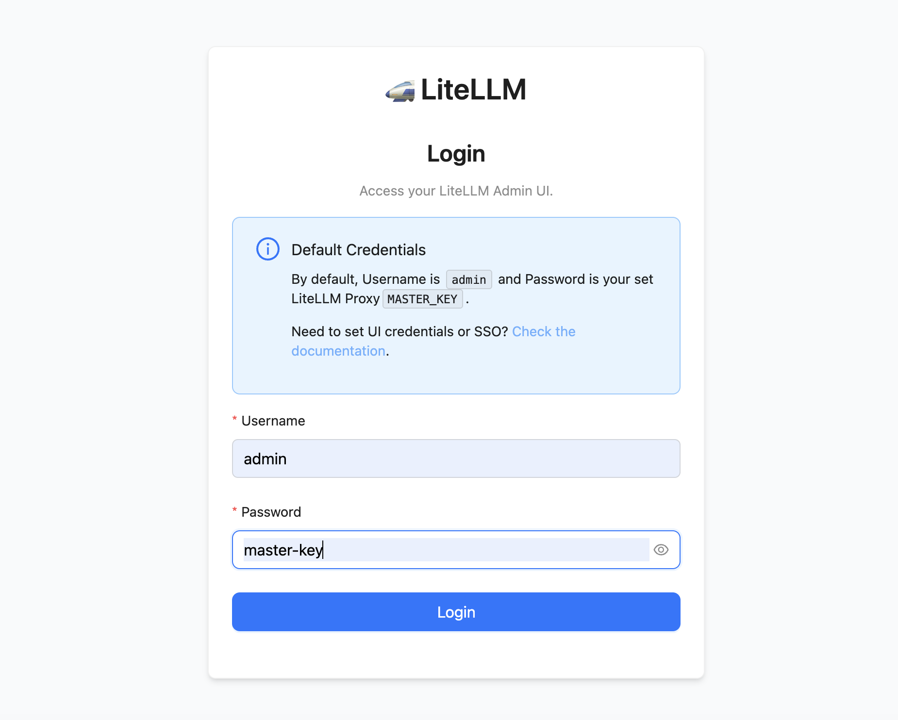
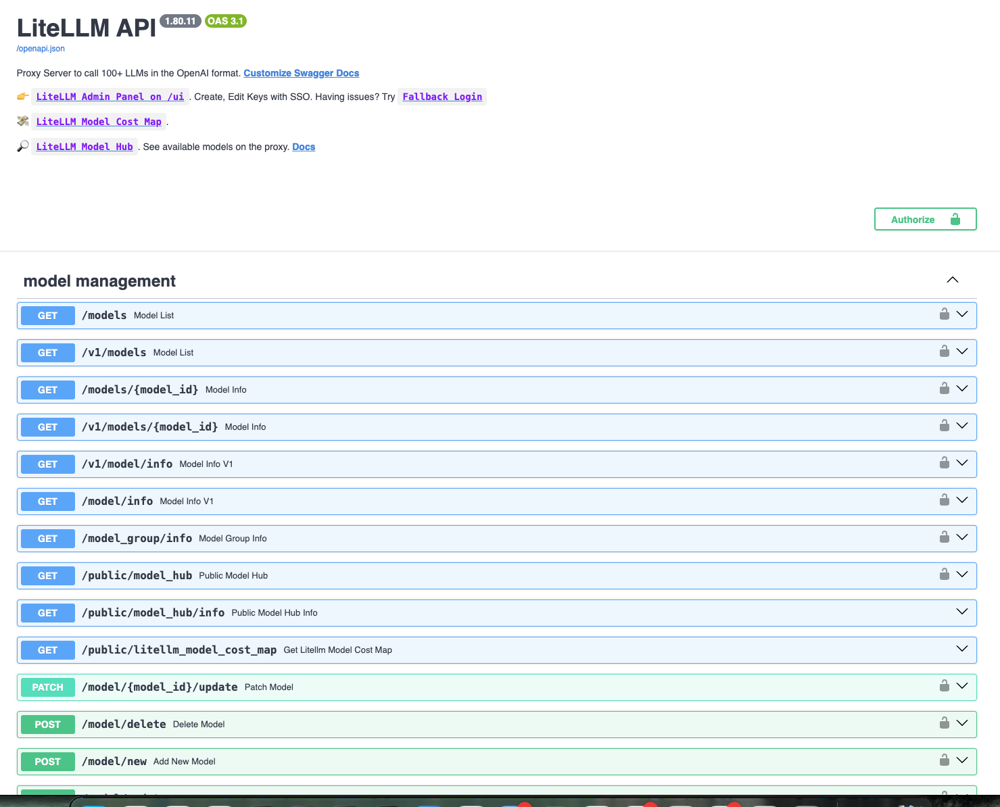
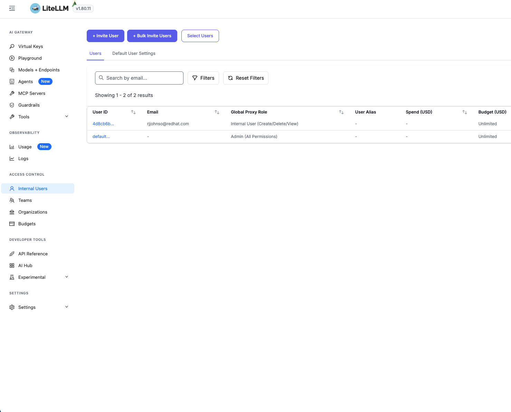
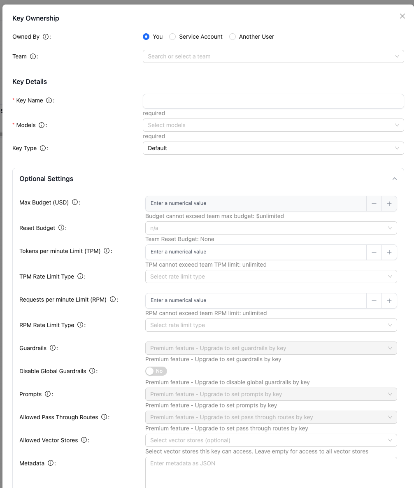
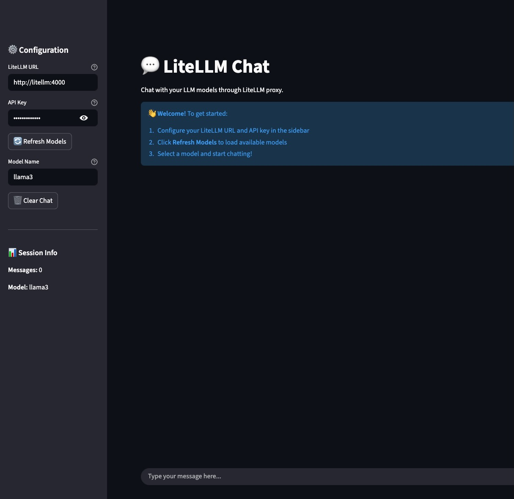

# LiteLLM POC Overview

This guide describes how the LiteLLM and LlamaStack demo works and provides step-by-step instructions for deploying, configuring, and running the application.

---

## What Gets Deployed

The demo application creates the following resources:

### Teams

| Team | Budget |
|------|--------|
| Engineering | $100 |
| Marketing | $50 |

### Users

| User | Team |
|------|------|
| eng-user@example.com | Engineering |
| mkt-user@example.com | Marketing |

---

## Configuration

You can customize the teams and users by editing `deploy/helm/values.yaml`:

```yaml
seed:
  enabled: true
  teams:
    - team_alias: engineering
      max_budget: 100.0
    - team_alias: marketing
      max_budget: 50.0
```

The seed data is processed by the [seed job](deploy/helm/templates/seed-job.yaml). When modified, this job creates users and teams as specified. All data is persisted in Postgres and survives restarts.

> [!NOTE]
> LiteLLM automatically creates API keys on behalf of users. Wait until the UI is fully running before creating users.

---

## Accessing the LiteLLM UI

### Step 1: Deploy the Application

Deploy the application using the instructions in the [Helm README](deploy/helm/README.md).

For a basic deployment, run:

```bash
make install
```

This creates all resources needed to run the demo.

### Step 2: Navigate to the LiteLLM Route

1. In OpenShift, go to the **Networking** tab in the left sidebar
2. Click **Routes**
3. Find and click the **LiteLLM** route (not LiteLLM-ui)

> [!TIP]
> The **LiteLLM** route is the Admin UI. The **LiteLLM-ui** route is the chat interface.

You should see the LiteLLM API Home Page:


### Step 3: Access the Admin Panel

Click **LiteLLM Admin Panel** in the menu to access the administration interface.



### Step 4: Sign In

Enter the following credentials:

| Field | Value |
|-------|-------|
| Username | `admin` |
| Password | Your `master_key` value |

After signing in, you will land on the API Key Page.

---

## Managing Users and API Keys

### Step 1: Create a User

1. Navigate to the **Users** tab
2. Click the **Invite User** button



### Step 2: Configure User Settings

Fill in the following fields:

| Field | Description |
|-------|-------------|
| **Email** | Any valid email address |
| **Global Proxy Role** | Admin (All), Admin (View Only), Internal User (CRUD), or Internal (View Only) |
| **Team** | The team to assign the user to |

> [!WARNING]
> Authorization can be assigned at both the user level and the group level. Ensure you configure the appropriate scope for your use case.

### Step 3: Understand API Key Benefits

Creating a new user grants access but requires an API key for authentication. API keys provide:

- **Secure distribution**: Share access without exposing provider API keys
- **Granular permissions**: Control what each user can access
- **Usage limits**: Set budgets and rate limits per key



### Step 4: Create an API Key

1. Navigate to **Virtual Keys**
2. Click **Create Key**



Configure the key with available parameters:

| Parameter | Description |
|-----------|-------------|
| Rate Limits | Maximum requests per time period |
| Model Restrictions | Allowed models for this key |
| Budget Restrictions | Spending limits |
| Guardrails | Content safety rules |

### Step 5: Save the API Key

Click **Create API Key** to generate the key.

> [!CAUTION]
> LiteLLM only displays the API key once upon creation. Copy and store it securely—you cannot retrieve it later.

---

## Using the Chat UI

Once you have created an API key, you can interact with the Streamlit chat application.

### Access the Chat Interface

1. Return to the **Routes** section in OpenShift
2. Click the **Chat UI** route



### Sidebar Controls

The sidebar provides the following configuration options:

| Control | Description |
|---------|-------------|
| **API Key** | The API key created via the LiteLLM Admin UI |
| **URL** | The OpenShift URL where LiteLLM is hosted (found in **Networking > Routes**) |
| **Model** | The model to use for the current chat session |

---

## Testing the Demo

With the chat interface configured, you can now test all demo scenarios in a live environment:

- **Budget limits**: Exceed a team's budget allocation
- **Rate limits**: Trigger rate limiting thresholds
- **Guardrails**: Test content safety rules

> [!IMPORTANT]
> When limits are exceeded or guardrails are triggered, you will receive descriptive error messages explaining the restriction.

